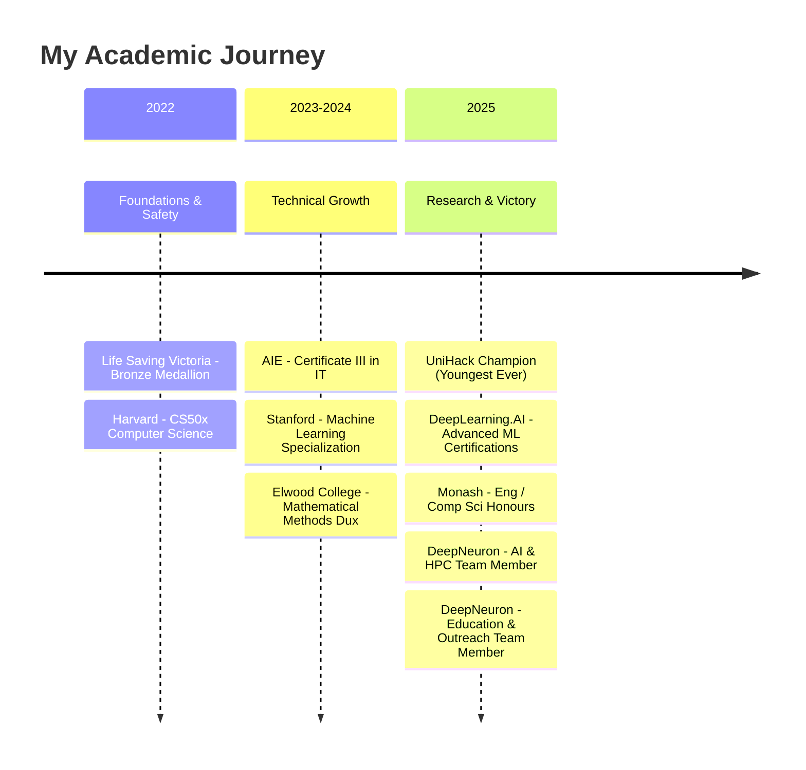

<!-- Enhanced 3D Animated Header -->

 

  

## 🚀 About Me

Hey! I'm Luca – a tech enthusiast diving deep into the worlds of **AI, software, and embedded systems**. Currently pursuing **Electrical Engineering & Computer Science (Honours) at Monash University**, where I'm pushing boundaries as part of the **Monash DeepNeuron AI technical team**. My passion thrives at the intersection of **machine learning, full-stack development, and hardware integration**.

When I'm not coding up a storm, you'll find me **backpacking, hiking, or planning my next adventure** (just returned from an epic Vietnam backpacking trip) or crushing climbs on my road bike! 🚴‍♂️

🆠Recent Highlights (click to expand)

- 🥇 **UniHack 2025 WINNER (February)** - First place out of 850+ participants
  - **Youngest ever winner in the history of Australia's largest student hackathon**
  - Created "Growth Garden" - an AI-powered life improvement tool
- 🧠 AI Research Team Member at Monash DeepNeuron
- 💼 Freelance AI Integration Specialist (Scag Australia & International Mowers)
- 🎓 Dux of Mathematical Methods (December 2024)
- 📚 Completed Stanford & DeepLearning.AI's ML Specializations (Feb 2025)

## 💻 Current Projects & Research

<table>
<tr>
<td width="50%">

### 🌱 Growth Garden (UniHack 2025 Winner)
- **First place project at Australia's largest student hackathon (February 2025)**
- Historic achievement: **Youngest ever winner in UniHack history**
- AI-powered life improvement tool that gamifies personal development
- Competed against 850+ university students and graduates
- [View Project](https://devpost.com/software/growth-garden)

</td>
<td width="50%">

### 🔬 Neural Cellular Automata
- Cutting-edge self-organizing system research
- PyTorch + WebGL implementation
- Modeling embryo development with neural networks
- Part of Monash DeepNeuron's advanced research division
- [View Project](https://www.neuralca.org/)
</td>
</tr>
<tr>
<td width="50%">

### 📊 MNIST Interactive Model Analyzer
- Custom 28x28 drawing grid for real-time digit recognition
- TensorFlow + PyTorch implementation
- Interactive visualization tools
- [GitHub Repository](https://github.com/LucaLow/MNIST-Interactive-Model-Analyzer)

</td>
<td width="50%">

### 🤖 AI Agent Development
- Building conversational AI for industrial equipment
- Knowledge retrieval pipelines
- Mobile-optimized interfaces
- Enterprise clients: Scag Australia & International Mowers

</td>
</tr>
</table>

## 🛠️ Tech Stack

## 📈 GitHub Stats

  
  
  
  

## 🎓 Education Journey

## 🌟 Experience Timeline

<b>🧠 Monash DeepNeuron (Feb 2025 - Present)</b>

- **AI & HPC Technical Team Member**
- Specializing in Neural Cellular Automata research
- Implementing cutting-edge ML methodologies with PyTorch
- **Educational Outreach**: Teaching students about AI fundamentals and applications
- Developing educational materials and workshops for student engagement
- Mentoring students in machine learning and neural networks

<b>💼 Freelance Software Engineer (Jan 2025 - Present)</b>

- **AI Integration Specialist**
- Built "Scag Mechanic" AI agent for Scag Australia
- Developed "IM Advisor" for International Mowers
- Engineered conversational prompts and knowledge-retrieval systems
- Mobile-optimized AI interfaces

<b>🕠Domino's Day Manager (Dec 2023 - Present)</b>

- Managing operations in high-pressure environments
- Ensuring exceptional customer service
- Leadership experience managing teams

## 🌍 Beyond Code

When I'm not pushing pixels or training models, you'll find me:

- 🚴‍♂️ Crushing climbs on my road bike
- 🎒 Backpacking through Southeast Asia (Vietnam was epic!)
- 🥾 Hiking and exploring the great outdoors
- 📚 Deep diving into research papers
- 🎮 Developing indie games in Unity

## 📫 Let's Connect!

I'm always excited to collaborate on innovative projects, discuss AI breakthroughs, or just geek out over tech! Reach out:

  
  
  
  
  

---

  

